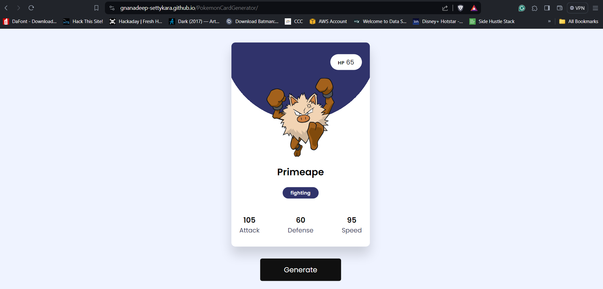

# Pokémon Card Generator 🌟

Welcome to the **Pokémon Card Generator**! 🎉 This web application brings the world of Pokémon to your fingertips by allowing you to generate unique Pokémon cards with just a click. Get ready to embark on a journey of randomness and discover new Pokémon cards with exciting stats and types.

## Getting Started 🚀

To unleash the magic of the Pokémon Card Generator:

1. Open the `index.html` file in your preferred web browser.
2. Click the "Generate" button, and behold the creation of a brand-new Pokémon card.
3. Dive into the Pokémon universe, exploring diverse cards with random stats and types.

## Preview 📸

## Technologies Used 🛠️

- **HTML**
- **CSS**
- **JavaScript**

### External Dependencies 🔗

- **Google Fonts**: Adds a touch of style to the text by utilizing the Poppins font.
  - [Google Fonts](https://fonts.google.com/specimen/Poppins)

- **PokeAPI**: Fetches Pokémon data to dynamically generate unique Pokémon cards.
  - [PokeAPI](https://pokeapi.co/)

These external dependencies enhance the visual appeal of the application and provide access to a vast database of Pokémon information for dynamic card generation. Feel free to explore and leverage these resources for further customization or improvements. 🌐🚀

## Features ✨

- **Random Generation**: Generates Pokémon cards with unique stats and types every time you click "Generate."
- **Dynamic Styling**: Sets background and type colors based on the Pokémon's primary type.
- **User-Friendly Design**: Simple and responsive layout for an enjoyable user experience.

## Code Overview 🧐

### HTML (`index.html`)

- Standard HTML structure with a container, card display area, and a magical "Generate" button.
- Links to Google Fonts and the enchanting stylesheet (`style.css`).
- Includes the spellbinding JavaScript file (`script.js`) for handling Pokémon card generation.

### JavaScript (`script.js`)

- Defines a `typeColor` object with colors for different Pokémon types.
- Summons Pokémon data from the mystical PokeAPI, crafting a new card with random stats and types.
- Dynamically conjures background and type colors based on the Pokémon's primary type.

### CSS (`style.css`)

- Styles the layout and appearance of the Pokémon card and the entire magical application.
- Utilizes flexbox to ensure a responsive and visually enchanting design.

## Customize 🎨

Feel free to sprinkle your magic on the styles, add more features, or summon additional functionalities to amplify the Pokémon Card Generator according to your whims.

Embark on the journey of creating and exploring Pokémon cards with the Pokémon Card Generator! If you have any questions or magical feedback, don't hesitate to reach out.

Happy coding and may your Pokémon adventures be legendary! 🌈🚀

